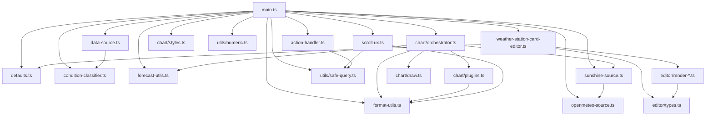

# Architecture

How the card is wired together. The current shape is the result of two
big refactor rounds: v1.1 split the original 2,200-line `main.js`
monolith into focused modules, v1.2 migrated everything to TypeScript,
and v1.9.x reorganized the editor partials around user intent rather
than technical structure. `main.ts` is now ~2,000 LOC of orchestrator —
it holds reactive properties, wires the data sources, and delegates
behaviour to the modules below.

If you're new to the codebase, read this in order: **[Module map](#module-map)**
→ **[Lifecycle](#lifecycle)** → **[Data flow](#data-flow)**, then dive
into the file you need to change.

## Module map

```
src/
├── main.ts                    LitElement WeatherStationCard. Entry
│                              point + thin orchestrator. Holds reactive
│                              properties (hass, config, forecasts),
│                              wires the data sources, calls into the
│                              modules below. The `set hass` setter is
│                              a 12-line orchestrator that delegates to
│                              three private phase methods (see
│                              [Lifecycle](#lifecycle)).
│
├── defaults.ts                (v1.9)  Single source of truth for the
│                              card's configuration defaults: DEFAULTS,
│                              DEFAULTS_FORECAST, DEFAULTS_UNITS. Both
│                              `setConfig` (user YAML merge) and
│                              `getStubConfig` (visual-editor "first
│                              add" path) consume this object so the
│                              two cannot drift.
│
├── data-source.ts             MeasuredDataSource (recorder polling)
│                              and ForecastDataSource (weather/subscribe_
│                              forecast). Both expose subscribe(cb) →
│                              unsubscribe and emit { forecast, error? }.
│
├── condition-classifier.ts    Pure decision-tree classifier — feed it
│                              temp/humidity/wind/lux/precip and it
│                              returns one of HA's weather condition
│                              IDs. Day / hour period dispatch.
│
├── forecast-utils.ts          Pure helpers: pickHourlyTickIndices,
│                              hourlyTempSeries, normalizeForecastMode,
│                              startOfTodayMs + the v1.0.2 midnight-
│                              transition guards.
│
├── format-utils.ts            Pure helpers for color parsing,
│                              separator-position algebra,
│                              computeInitialScrollLeft.
│
├── sunshine-source.ts         attachSunshine + overlayFromOpenMeteo —
│                              tags every forecast entry with a daily
│                              or hourly sunshine value.
│
├── openmeteo-source.ts        Open-Meteo API fetcher with localStorage
│                              caching, abortable on disconnect.
│
├── scroll-ux.ts               Wraps the .forecast-scroll-block: drag-
│                              to-scroll, indicator chevrons, jump-to-now
│                              button, scroll-date overlays.
│                              setupScrollUx(card) returns a teardown.
│
├── action-handler.ts          Pointer-based tap / hold / double-tap
│                              detection on ha-card + dispatcher
│                              (more-info, navigate, url, toggle,
│                              perform-action, assist, fire-dom-event).
│                              setupActionHandler(card) + runAction.
│
├── teardown-registry.ts       Lifecycle-cleanup primitive used by
│                              extracted modules so disconnectedCallback
│                              drains them in lockstep.
│
├── utils/
│   ├── safe-query.ts          shadowRoot?.querySelector helper.
│   └── numeric.ts             parseNumericSafe — returns null instead
│                              of NaN on un-parseable input.
│
├── chart/
│   ├── orchestrator.ts        drawChartUnsafe(card, args) — assembles
│   │                          datasets + plugins, calls buildChart.
│   │
│   ├── draw.ts                Chart.js instance builder — buildChart(ctx,
│   │                          opts) returns a configured Chart.
│   │
│   ├── plugins.ts             Barrel re-export of the four Chart.js
│   │                          plugin factories under plugins/ (split
│   │                          per #57).
│   │
│   ├── plugins/               Per-plugin source: _shared.ts, separator.ts,
│   │                          daily-tick-labels.ts, precip-label.ts,
│   │                          sunshine-label.ts.
│   │
│   └── styles.ts              cardStyles({...}) — returns the CSS
│                              string for the card's <style> block.
│
├── editor/                    (v1.9 reorg)  Editor render partials.
│   │                          Sections cluster by user intent rather
│   │                          than by technical concern — see ADR-0005.
│   ├── types.ts               Shared types: EditorLike, EditorContext,
│   │                          TFn, ChangeEvt.
│   ├── render-mode.ts         Section 1 — "Karte einrichten" / Card
│   │                          setup. Mode (station/forecast/combination)
│   │                          and chart-type radios.
│   ├── render-forecast.ts     Section 2 — "Wettervorhersage" / Weather
│   │                          forecast. weather_entity picker.
│   ├── render-sensors.ts      Section 3 — "Sensoren" / Sensors. Past-
│   │                          data window (days) + sensor pickers
│   │                          (ha-form, ranked auto-detect).
│   ├── render-chart.ts        Section 4 — "Diagramm" / Chart. Time
│   │                          range, chart rows, appearance/style.
│   ├── render-live-panel.ts   Section 5 — "Live-Anzeige" / Live panel.
│   │                          Main panel + attributes-row toggles.
│   ├── render-units.ts        Section 6 — "Einheiten" / Units.
│   └── render-tap.ts          Section 7 — "Aktionen" / Actions. Tap /
│                              hold / double-tap selectors.
│
├── weather-station-card-editor.ts   LitElement editor host. Owns
│                              mutator methods (_valueChanged,
│                              _sensorsChanged, _conditionMappingChanged,
│                              _setMode, _renderSunshineAvailabilityHint,
│                              etc.); render() delegates to the seven
│                              partials above.
│
├── const.ts                   weatherIcons / cardinal-direction tables.
└── locale.ts                  Per-language string tables.
```

### Module dependency graph



## Lifecycle

The card is a Lit reactive element. The interesting hooks:

```
static assertConfig(config)
  └─ structural pre-flight check — throws so HA falls back to the
     YAML editor instead of trying (and failing) to render the
     visual editor against an invalid config.

setConfig(config)
  ├─ defaults applied (DEFAULTS / DEFAULTS_FORECAST / DEFAULTS_UNITS)
  ├─ invalidation flags reset
  └─ mode-aware required-key validation
     (station mode → sensors.temperature; forecast → weather_entity)

set hass(hass)               ← v1.9.x: 12-line orchestrator
  ├─ this._hass / language / sun (3 lines)
  ├─ _extractSensorReadings(hass)
  │     Phase 1 — sensor entity reads, source-unit detection,
  │     weather_entity attribute fallback for forecast-only mode.
  │     Mutates this.<reading> + this._sourceWindUnit etc.
  ├─ _classifyLiveCondition(hass)
  │     Phase 2 — minute-memoized classifier + synthesized weather
  │     stand-in. Same classifier as forecast columns, fed with
  │     instantaneous values + an instantaneous clear-sky reference.
  └─ _syncDataSources(hass)
        Phase 3 — subscribe / unsubscribe MeasuredDataSource and
        ForecastDataSource to match show_station / show_forecast,
        scan for missing sensor entities. Symmetrical to
        disconnectedCallback's teardown side.

connectedCallback()
  └─ schedules attachResizeObserver

firstUpdated()
  └─ measureCard → drawChart

updated(changedProperties)
  ├─ setupActionHandler(this)        ← idempotent on stable ha-card
  ├─ _maybeApplyInitialScroll(...)
  ├─ setupScrollUx(this)             ← idempotent on stable wrapper
  └─ if config changed:
       _invalidateStaleSources(oldConfig)

data callbacks (from sources):
  this._stationData / this._forecastData ← event.forecast
  └─ _refreshForecasts()
       ├─ midnight-transition guards
       │   (filterMidnightStaleForecast, dropEmptyStationToday)
       ├─ overlayFromOpenMeteo (sunshine attach)
       └─ measureCard → drawChart

disconnectedCallback()
  ├─ detachResizeObserver
  ├─ _teardownStation / _teardownForecast
  ├─ _teardownInitialScrollObserver
  ├─ _scrollUxTeardown / _actionHandlerTeardown
  └─ clearInterval(this._clockTimer)
```

The phase tag (`this._chartPhase`) is set at three points in
`drawChartUnsafe` (`'compute'`, `'init'`, then cleared on success). When
something throws, the catch block in `main.ts` `drawChart()` reads it
to label the error banner — useful when the error message is generic
and you need to know whether the crash was during data shaping vs.
Chart.js init vs. plugin draw.

## Data flow

The render layer always reads from `this.forecasts` — a single array
of merged station + forecast entries. Every entry has:

```ts
{
  datetime: ISOString,             // midnight of the day, local
  temperature: number | null,      // daily max
  templow: number | null,          // daily min
  precipitation: number | null,    // mm or in (depending on length unit)
  wind_speed: number | null,       // mean
  wind_gust_speed: number | null,  // daily max
  wind_bearing: number | null,     // mean degrees
  pressure: number | null,
  humidity: number | null,
  uv_index: number | null,
  condition: string,               // HA condition ID
  sunshine?: number | null,        // hours of sunshine for the day
  day_length?: number | null,      // hours from sunrise to sunset
}
```

`_refreshForecasts` is the single concatenation point:

```js
const station = this._stationData;       // 7 days
const forecast = filterMidnightStaleForecast(this._forecastData, todayStartMs)
  .slice(0, limit);                       // 7 days, no leftover yesterday
const cleaned = dropEmptyStationToday(station, todayStartMs);
this.forecasts = overlayFromOpenMeteo(
  [...cleaned, ...forecast], hass, sunshineSource, granularity
);
```

The two midnight-transition guards (added in v1.0.2) handle the corner
case where station's "today" bucket is empty (recorder hasn't
aggregated yet) and forecast's first entry is still labeled "yesterday"
(weather integration's daily forecast hasn't refreshed).

## Why we have two label-rendering systems

`chartjs-plugin-datalabels` renders the temperature labels on the line
points (configurable via `forecast.style: 'style1' | 'style2'`). The
precipitation labels are rendered by a custom `precipLabelPlugin` because
the plugin can't render a single label with two different font sizes
(number at base, "mm" at half size). This is documented inline in
`chart/orchestrator.ts` — see the comment block above `precipLabelPlugin`.

## Build pipeline

```
npm run lint       →  eslint src tests-e2e   (ESLint 10 flat-config)
npm run typecheck  →  tsc --noEmit
npm run test       →  vitest run             (469 tests across 15 modules)
npm run depcheck   →  depcruise src          (architecture rules)
npm run rollup     →  rollup -c              (single dist/weather-station-card.js)
npm run build      =  lint + typecheck + test + rollup
```

Rollup applies a small inline `injectCardVersion` plugin (since v1.9.x —
see ADR-0006) that replaces the literal `'__CARD_VERSION__'` in
`src/main.ts` with the version from `package.json`. The console banner
on card load thus stays in sync with the released version automatically;
no manual bump at release time.

CI (`.github/workflows/build.yml`) runs the same chain on every push,
extended with these gates (since v1.4.2 — issue #19):

- **Security audit**: `npm audit --audit-level=high` blocks the build
  on high/critical advisories. Lower-severity findings come as
  Dependabot PRs (`.github/dependabot.yml`, weekly).
- **Lint**: ESLint 10 with `typescript-eslint`, `eslint-plugin-lit`,
  `eslint-plugin-sonarjs`. Zero errors required; complexity warnings
  tracked as backlog (see `eslint.config.mjs`). Each rule starts as
  `warn` while legacy hot-spots exist and is promoted to `error` once
  it reaches zero violations — v1.10 locked in seven such rules
  (`max-depth`, `lit/no-useless-template-literals`,
  `lit/attribute-value-entities`, `sonarjs/no-identical-functions`,
  `sonarjs/no-collapsible-if`, `sonarjs/prefer-single-boolean-return`,
  `sonarjs/no-redundant-jump`).
- **Coverage gate at ≥ 80 %** (statements, branches, functions, lines).
  Configured in `vitest.config.js`. Failing the gate fails the build.
  Note: pre-v1.4.2 the include array listed `.js` paths after the
  v1.2 TS migration and matched zero files — the gate was silently
  inert. Paths are `.ts` now.
- **Architecture rules**: `dependency-cruiser` enforces no-circular,
  no-orphans, and module boundaries (`src/chart/`, `src/editor/`,
  `src/utils/` may not uplevel-import).
- **Bundle budget at < 800 KB raw / < 250 KB gzipped** (CI-enforced
  since v1.10, #111). Tripping either signals a regression in
  tree-shaking or an accidental large dep. Gzip is the bytes-on-the-wire
  metric HACS download size and HA's frontend cache actually pay for.
- **CodeQL** (`security-extended` queries) on every PR + weekly
  schedule, covering JS/TS security smells ESLint doesn't catch.
- **SonarCloud** (`.github/workflows/sonarcloud.yml`) reads the
  Vitest LCOV output and reports Cognitive Complexity, Code Smells,
  Security Hotspots, and Coverage trend. Not a required check —
  advisory only so a Sonar outage doesn't block merges.
- Verifies `dist/weather-station-card.js` is in sync with source.
- On tag pushes, verifies `package.json` version matches the tag,
  then uploads the bundle as a release asset.

`permissions: contents: write` is set at job level so the release action
can attach the bundle.

The `master` branch is protected: PRs only, with `build` and
`Analyze (javascript-typescript)` required-green before merge,
linear history enforced, force-push and deletion blocked.

## Distribution

HACS pulls the latest GitHub release. Users get one file
(`weather-station-card.js`) and Home Assistant serves it precompressed
(`.js.gz`) when the browser supports gzip. After every local deploy to a
test HA instance, regenerate the `.gz` or HA will keep serving the stale
compressed version.

Cache-busting in HA goes through the resource URL's `?hacstag=` query.
After bumping versions in HA's resources panel, every browser is forced
to re-fetch.

## Testing scope

What's tested (Vitest, `tests/*.test.js`, 469 tests across 15 files):

- `condition-classifier.ts` — every decision-tree branch, threshold
  edges, override merging, per-period (daily / hourly) thresholds.
- `data-source.ts` — `bucketPrecipitation` for all three state-class
  paths (daily + hourly buckets), `_buildForecast` / `_buildHourlyForecast`
  chronology / shape / live-fallback, both data-source classes' subscribe
  / error / dispose for both modes.
- `format-utils.ts` — colour parsers, separator-position algebra,
  `computeInitialScrollLeft` positioning.
- `forecast-utils.ts` — `pickHourlyTickIndices`, `hourlyTempSeries`,
  `normalizeForecastMode`, `startOfTodayMs`,
  `filterMidnightStaleForecast`, `dropEmptyStationToday`.
- `sunshine-source.ts`, `openmeteo-source.ts` — attach + URL-build +
  parse paths.
- `chart/plugins.ts` (and the per-plugin files under `chart/plugins/`)
  — every plugin factory (separator, dailyTickLabels, precipLabel,
  sunshineLabel).
- `scroll-ux.ts` — updateScrollIndicators visibility math,
  updateScrollDateStamps clamping, setupScrollUx idempotency on stable
  wrapper.
- `action-handler.ts` — fake-timer-driven tap / hold / double-tap
  sequencing, isCardControl filter, drag-suppress, every runAction
  branch.
- `teardown-registry.ts` — push / drain / error-isolation / reusability.
- `utils/safe-query.ts`, `utils/numeric.ts` — defensive null paths.
- `defaults.ts` — DEFAULTS / DEFAULTS_FORECAST / DEFAULTS_UNITS shape
  and schema-drift CI test (issue #93).
- Editor mutator methods (`tests/editor.test.js`) — `_valueChanged` with
  dotted-key writes, `_sensorPickerChanged` add/replace/delete,
  `_actionChanged`, `_conditionMappingChanged`, `_setMode`, `_mode`
  getter.
- Editor render-partial smoketests
  (`tests/editor-render-chart.test.js`, `tests/editor-render-live-panel.test.js`) —
  jsdom + Lit `render()` against mock EditorLike + EditorContext;
  validates section headings, sub-section structure, gating
  (`hasSensor` / `hasLiveValue`, master toggles), and that the
  partial doesn't throw under default config.

CI gates branch + line coverage at **80 %** (vitest v8 provider).

What's intentionally **not** unit-tested (covered by Playwright E2E
since v1.3 — issue #14):

- `main.ts` Lit lifecycle — that's framework contract (LitElement spec).
- Chart.js render output — it's a canvas, asserting pixels is brittle in
  unit tests. Playwright visual regression covers it.
- Editor render() — full-page DOM-render assertions belong in E2E.
  The mutator methods + per-partial smoketests already cover the
  config-shape behaviour and the partial-level structure; the editor
  host's render() integration is a Playwright concern.
- Pointer / touch gesture sequences (drag-vs-tap, pointercancel) —
  unit tests can mock pointer events, but the macrotask vs. microtask
  ordering only manifests in a real browser.

If you're adding logic that crosses these boundaries (e.g. "does setting
config X cause data source Y to re-subscribe?"), prefer extracting the
decision into a pure helper in `data-source.ts` or `format-utils.ts` and
testing it there.

## Future-friendly directions

The current design supports several near-term extensions without rework:

- **New data source type** — implement `subscribe(cb) → unsubscribe`
  emitting the forecast shape; merge logic in `_refreshForecasts`
  already concatenates arbitrary segments.
- **New metric on the chart** — add the field to `_buildForecast`, then
  a new dataset assembly in `chart/orchestrator.ts`. The plugins read
  from `meta.data[i]` generically.
- **Schema validation** — wrap `_refreshForecasts`'s input with a
  validator (`zod` or hand-rolled); drop bad entries before they reach
  Chart.js. Currently we trust the data sources.

Things that would require structural work:

- **Per-bar widths or non-uniform column spacing.** Tried during v0.5
  development and reverted. Chart.js category scale doesn't support
  per-bar widths; linear-scale workarounds redistribute *all* spacing.
  If revived, it needs a clear UX contract first.
- **Sub-hour granularity.** Daily and hourly are both supported as of
  v0.8. Going finer (15-min, 5-min) would need a new bucket-size
  primitive in `bucketPrecipitation` and likely a different chart layout
  — Chart.js category-scale runs out of horizontal pixels around ~200
  columns even with scrolling.

## Architecture decision records

Substantial architectural decisions are captured under `docs/adr/`. The
template (`docs/adr/template.md`) follows the Nygard format. Existing
records:

- **0001** dist committed for HACS distribution
- **0002** Sunshine-duration tier policy
- **0003** E2E baselines pinned to GHA runners
- **0004** TypeScript strict with boundary relaxations
- **0005** Editor partial reorg (user-intent clustering, 7 sections)
- **0006** Build-time `__CARD_VERSION__` injection via Rollup
- **0007** `set hass` 3-phase decomposition
- **0008** DEFAULTS as single source of truth (`src/defaults.ts`)

Add a new ADR when a decision is hard to reverse (boundary contracts,
distribution model, build-time invariants) or surprising enough that
a future reader might unwind it without realising the trade-off.
