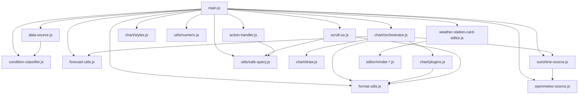

# Architecture

How the card is wired together. The current shape is the result of the
v1.1 refactor — what was a single 2,200-line `main.js` with most of the
behaviour as inline methods is now an orchestrator (~1,470 LOC) that
delegates to seven focused modules.

If you're new to the codebase, read this in order: **[Module map](#module-map)**
→ **[Lifecycle](#lifecycle)** → **[Data flow](#data-flow)**, then dive
into the file you need to change.

## Module map

```
src/
├── main.js                    LitElement WeatherStationCard. Entry
│                              point + thin orchestrator. Holds reactive
│                              properties (hass, config, forecasts),
│                              wires the data sources, calls into the
│                              modules below.
│
├── data-source.js             MeasuredDataSource (recorder polling)
│                              and ForecastDataSource (weather/subscribe_
│                              forecast). Both expose subscribe(cb) →
│                              unsubscribe and emit { forecast, error? }.
│
├── condition-classifier.js    Pure decision-tree classifier — feed it
│                              temp/humidity/wind/lux/precip and it
│                              returns one of HA's weather condition
│                              IDs. Day / hour period dispatch.
│
├── forecast-utils.js          Pure helpers: pickHourlyTickIndices,
│                              hourlyTempSeries, normalizeForecastMode,
│                              startOfTodayMs + the v1.0.2 midnight-
│                              transition guards.
│
├── format-utils.js            Pure helpers for color parsing,
│                              separator-position algebra,
│                              computeInitialScrollLeft.
│
├── sunshine-source.js         attachSunshine + overlayFromOpenMeteo —
│                              tags every forecast entry with a daily
│                              or hourly sunshine value.
│
├── openmeteo-source.js        Open-Meteo API fetcher with localStorage
│                              caching, abortable on disconnect.
│
├── scroll-ux.js               (v1.1)  Wraps the .forecast-scroll-block:
│                              drag-to-scroll, indicator chevrons,
│                              jump-to-now button, scroll-date
│                              overlays. setupScrollUx(card) returns a
│                              teardown.
│
├── action-handler.js          (v1.1)  Pointer-based tap / hold /
│                              double-tap detection on ha-card +
│                              dispatcher (more-info, navigate, url,
│                              toggle, perform-action, assist,
│                              fire-dom-event). setupActionHandler(card)
│                              + runAction(card, actionConfig).
│
├── teardown-registry.js       (v1.1)  Lifecycle-cleanup primitive used
│                              by extracted modules so disconnectedCallback
│                              drains them in lockstep.
│
├── utils/
│   ├── safe-query.js          (v1.1)  shadowRoot?.querySelector helper.
│   └── numeric.js             (v1.1)  parseNumericSafe — returns null
│                              instead of NaN on un-parseable input.
│
├── chart/
│   ├── orchestrator.js        (v1.1)  drawChartUnsafe(card, args) —
│   │                          assembles datasets + plugins, calls
│   │                          buildChart(). Was main.js's largest
│   │                          method (~290 LOC) before extraction.
│   │
│   ├── config.js              (planned for v1.2)  Reserved for the
│   │                          options-builder split out of draw.js.
│   │
│   ├── draw.js                Chart.js instance builder — buildChart(ctx,
│   │                          opts) returns a configured Chart.
│   │
│   ├── plugins.js             Chart.js plugin factories: separator,
│   │                          dailyTickLabels, precipLabel,
│   │                          sunshineLabel.
│   │
│   └── styles.js              cardStyles({...}) — returns the CSS
│                              string for the card's <style> block.
│
├── editor/                    (v1.1)  Editor render partials.
│   ├── render-setup.js        Section A — title, mode, days, weather
│   │                          entity, forecast type, actions.
│   ├── render-sensors.js      Section B — sensor pickers (ha-form +
│   │                          buildSensorsSchema).
│   ├── render-layout.js       Section C — main panel + attributes +
│   │                          chart rows.
│   ├── render-style.js        Section D — chart style, sizing, icons,
│   │                          colours.
│   ├── render-units.js        Section E — units ha-form.
│   └── render-advanced.js     Section F — locale, condition_mapping
│                              overrides.
│
├── weather-station-card-editor.js   LitElement editor. Owns mutator
│                              methods (_valueChanged, _sensorsChanged
│                              etc.); render() delegates to the partials
│                              above.
│
├── const.js                   weatherIcons / cardinal-direction tables.
└── locale.js                  Per-language string tables.
```

### Module dependency graph



## Lifecycle

The card is a Lit reactive element. The interesting hooks:

```
setConfig(config)
  └─ defaults applied + invalidation flags reset

set hass(hass)
  ├─ live "current condition" classifier (memoized at minute precision)
  ├─ MeasuredDataSource subscribe (if !this._dataSource)
  └─ ForecastDataSource subscribe (if !this._forecastSource)

connectedCallback()
  └─ schedules attachResizeObserver

firstUpdated()
  └─ measureCard → drawChart

updated(changedProperties)
  ├─ setupActionHandler(this)        ← idempotent on stable ha-card
  ├─ _maybeApplyInitialScroll(...)
  ├─ setupScrollUx(this)             ← idempotent on stable wrapper
  └─ if config changed:
       _invalidateStaleSources(oldConfig)

data callbacks (from sources):
  this._stationData / this._forecastData ← event.forecast
  └─ _refreshForecasts()
       ├─ midnight-transition guards
       │   (filterMidnightStaleForecast, dropEmptyStationToday)
       ├─ overlayFromOpenMeteo (sunshine attach)
       └─ measureCard → drawChart

disconnectedCallback()
  ├─ detachResizeObserver
  ├─ _teardownStation / _teardownForecast
  ├─ _teardownInitialScrollObserver
  ├─ _scrollUxTeardown / _actionHandlerTeardown
  └─ clearInterval(this._clockTimer)
```

The phase tag (`this._chartPhase`) is set at three points in
`drawChartUnsafe` (`'compute'`, `'init'`, then cleared on success). When
something throws, the catch block in `main.js` `drawChart()` reads it
to label the error banner — useful when the error message is generic
and you need to know whether the crash was during data shaping vs.
Chart.js init vs. plugin draw.

## Data flow

The render layer always reads from `this.forecasts` — a single array
of merged station + forecast entries. Every entry has:

```ts
{
  datetime: ISOString,             // midnight of the day, local
  temperature: number | null,      // daily max
  templow: number | null,          // daily min
  precipitation: number | null,    // mm or in (depending on length unit)
  wind_speed: number | null,       // mean
  wind_gust_speed: number | null,  // daily max
  wind_bearing: number | null,     // mean degrees
  pressure: number | null,
  humidity: number | null,
  uv_index: number | null,
  condition: string,               // HA condition ID
  sunshine?: number | null,        // hours of sunshine for the day
  day_length?: number | null,      // hours from sunrise to sunset
}
```

`_refreshForecasts` is the single concatenation point:

```js
const station = this._stationData;       // 7 days
const forecast = filterMidnightStaleForecast(this._forecastData, todayStartMs)
  .slice(0, limit);                       // 7 days, no leftover yesterday
const cleaned = dropEmptyStationToday(station, todayStartMs);
this.forecasts = overlayFromOpenMeteo(
  [...cleaned, ...forecast], hass, sunshineSource, granularity
);
```

The two midnight-transition guards (added in v1.0.2) handle the corner
case where station's "today" bucket is empty (recorder hasn't
aggregated yet) and forecast's first entry is still labeled "yesterday"
(weather integration's daily forecast hasn't refreshed).

## Why we have two label-rendering systems

`chartjs-plugin-datalabels` renders the temperature labels on the line
points (configurable via `forecast.style: 'style1' | 'style2'`). The
precipitation labels are rendered by a custom `precipLabelPlugin` because
the plugin can't render a single label with two different font sizes
(number at base, "mm" at half size). This is documented inline in
`chart/orchestrator.js` — see the comment block above `precipLabelPlugin`.

## Build pipeline

```
npm run lint       →  eslint src tests-e2e   (ESLint 10 flat-config)
npm run typecheck  →  tsc --noEmit
npm run test       →  vitest run             (385 tests across 12 modules)
npm run depcheck   →  depcruise src          (architecture rules)
npm run rollup     →  rollup -c              (single dist/weather-station-card.js)
npm run build      =  lint + typecheck + test + rollup
```

CI (`.github/workflows/build.yml`) runs the same chain on every push,
extended with these gates (since v1.4.2 — issue #19):

- **Security audit**: `npm audit --audit-level=high` blocks the build
  on high/critical advisories. Lower-severity findings come as
  Dependabot PRs (`.github/dependabot.yml`, weekly).
- **Lint**: ESLint 10 with `typescript-eslint`, `eslint-plugin-lit`,
  `eslint-plugin-sonarjs`. Zero errors required; complexity warnings
  tracked as backlog (see `eslint.config.mjs`).
- **Coverage gate at ≥ 80 %** (statements, branches, functions, lines).
  Configured in `vitest.config.js`. Failing the gate fails the build.
  Note: pre-v1.4.2 the include array listed `.js` paths after the
  v1.2 TS migration and matched zero files — the gate was silently
  inert. Paths are `.ts` now.
- **Architecture rules**: `dependency-cruiser` enforces no-circular,
  no-orphans, and module boundaries (`src/chart/`, `src/editor/`,
  `src/utils/` may not uplevel-import).
- **Bundle budget at < 800 KB**. Tripping signals a regression in
  tree-shaking or an accidental large dep.
- **CodeQL** (`security-extended` queries) on every PR + weekly
  schedule, covering JS/TS security smells ESLint doesn't catch.
- **SonarCloud** (`.github/workflows/sonarcloud.yml`) reads the
  Vitest LCOV output and reports Cognitive Complexity, Code Smells,
  Security Hotspots, and Coverage trend. Not a required check —
  advisory only so a Sonar outage doesn't block merges.
- Verifies `dist/weather-station-card.js` is in sync with source.
- On tag pushes, verifies `package.json` version matches the tag,
  then uploads the bundle as a release asset.

`permissions: contents: write` is set at job level so the release action
can attach the bundle.

The `master` branch is protected: PRs only, with `build` and
`Analyze (javascript-typescript)` required-green before merge,
linear history enforced, force-push and deletion blocked.

## Distribution

HACS pulls the latest GitHub release. Users get one file
(`weather-station-card.js`) and Home Assistant serves it precompressed
(`.js.gz`) when the browser supports gzip. After every local deploy to a
test HA instance, regenerate the `.gz` or HA will keep serving the stale
compressed version.

Cache-busting in HA goes through the resource URL's `?hacstag=` query.
After bumping versions in HA's resources panel, every browser is forced
to re-fetch.

## Testing scope

What's tested (Vitest, `tests/*.test.js`, 361 tests as of v1.1):

- `condition-classifier.js` — every decision-tree branch, threshold
  edges, override merging, per-period (daily / hourly) thresholds.
- `data-source.js` — `bucketPrecipitation` for all three state-class
  paths (daily + hourly buckets), `_buildForecast` / `_buildHourlyForecast`
  chronology / shape / live-fallback, both data-source classes' subscribe
  / error / dispose for both modes.
- `format-utils.js` — colour parsers, separator-position algebra,
  `computeInitialScrollLeft` positioning.
- `forecast-utils.js` — `pickHourlyTickIndices`, `hourlyTempSeries`,
  `normalizeForecastMode`, `startOfTodayMs`,
  `filterMidnightStaleForecast`, `dropEmptyStationToday`.
- `sunshine-source.js`, `openmeteo-source.js` — attach + URL-build +
  parse paths.
- `chart/plugins.js` — every plugin factory (separator, dailyTickLabels,
  precipLabel, sunshineLabel).
- `scroll-ux.js` — updateScrollIndicators visibility math,
  updateScrollDateStamps clamping, setupScrollUx idempotency on stable
  wrapper.
- `action-handler.js` — fake-timer-driven tap / hold / double-tap
  sequencing, isCardControl filter, drag-suppress, every runAction
  branch.
- `teardown-registry.js` — push / drain / error-isolation / reusability.
- `utils/safe-query.js`, `utils/numeric.js` — defensive null paths.
- Editor mutator methods (`tests/editor.test.js`) — `_valueChanged` with
  dotted-key writes, `_sensorPickerChanged` add/replace/delete,
  `_actionChanged`, `_conditionMappingChanged`, `_setMode`, `_mode`
  getter.

CI gates branch + line coverage at **80 %** (vitest v8 provider).

What's intentionally **not** unit-tested (planned for v1.3 via
Playwright E2E + visual regression — issue #14):

- `main.js` Lit lifecycle — that's framework contract (LitElement spec).
- Chart.js render output — it's a canvas, asserting pixels is brittle in
  unit tests. v1.3 closes this via Playwright visual regression.
- Editor render() and the 5 render partials — DOM-render assertions
  belong in E2E. The mutator methods that *do* have unit tests cover
  the actual config-shape behaviour.
- Pointer / touch gesture sequences (drag-vs-tap, pointercancel) —
  unit tests can mock pointer events, but the macrotask vs. microtask
  ordering only manifests in a real browser.

If you're adding logic that crosses these boundaries (e.g. "does setting
config X cause data source Y to re-subscribe?"), prefer extracting the
decision into a pure helper in `data-source.js` or `format-utils.js` and
testing it there.

## Future-friendly directions

The current design supports several near-term extensions without rework:

- **New data source type** — implement `subscribe(cb) → unsubscribe`
  emitting the forecast shape; merge logic in `_refreshForecasts`
  already concatenates arbitrary segments.
- **New metric on the chart** — add the field to `_buildForecast`, then
  a new dataset assembly in `chart/orchestrator.js`. The plugins read
  from `meta.data[i]` generically.
- **Schema validation** — wrap `_refreshForecasts`'s input with a
  validator (`zod` or hand-rolled); drop bad entries before they reach
  Chart.js. Currently we trust the data sources.

Things that would require structural work:

- **Per-bar widths or non-uniform column spacing.** Tried during v0.5
  development and reverted. Chart.js category scale doesn't support
  per-bar widths; linear-scale workarounds redistribute *all* spacing.
  If revived, it needs a clear UX contract first.
- **Sub-hour granularity.** Daily and hourly are both supported as of
  v0.8. Going finer (15-min, 5-min) would need a new bucket-size
  primitive in `bucketPrecipitation` and likely a different chart layout
  — Chart.js category-scale runs out of horizontal pixels around ~200
  columns even with scrolling.

## v1.2+ planned work

Tracked as a sequence of release-tracking issues so each step ships
independently:

- [#13](https://github.com/chriguschneider/weather-station-card/issues/13) **v1.2 — TypeScript migration**: full `.ts` migration in
  dependency order, Lit `@property` decorators. The post-v1.1 module
  graph above is the typing surface.
- [#14](https://github.com/chriguschneider/weather-station-card/issues/14) **v1.3 — Playwright E2E + visual regression**: closes the
  test-coverage gap for `main.js`'s Lit lifecycle, editor click-paths,
  and Chart.js rendering — the surfaces excluded from the v1.0 / v1.1
  unit-test gate.
- [#15](https://github.com/chriguschneider/weather-station-card/issues/15) **v1.4 — Mode-toggle perf** (closes [#10](https://github.com/chriguschneider/weather-station-card/issues/10)):
  parallel data-sources or lazy cache so the daily ↔ hourly toggle
  is instant.

Each release is independently shippable; the maintainer can pause
between any two without leaving the codebase in a half-state.
