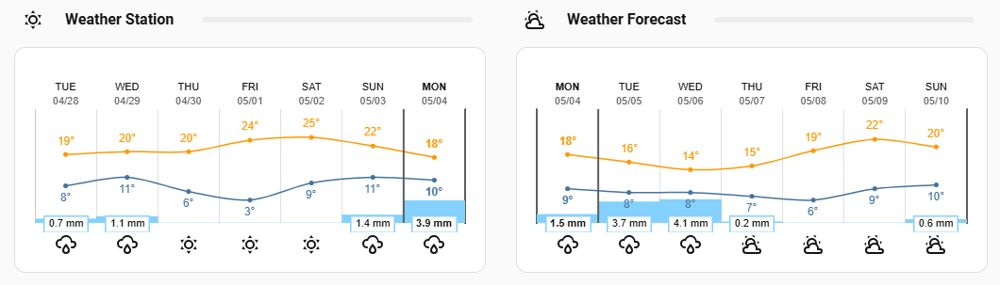

# Weather Station Card

[](LICENSE.md)
[](https://hacs.xyz/)

A Lovelace card that shows **past weather-station measurements** in the same
per-day layout as [`weather-chart-card`](https://github.com/mlamberts78/weather-chart-card),
plus a live "current condition" main panel — both driven entirely by your
sensor history (`recorder/statistics_during_period`) instead of a `weather.*`
entity's forecast.


## What this card does

Most Lovelace weather cards visualise a forecast served by a `weather.*`
entity. If you actually run a weather station on-site (Shelly Plus H&T,
BTHome, ESPHome, Pirateweather receiver, …), the more interesting view is
*what happened over the past N days* — and the most useful "now" panel
reflects the live readings of those same sensors. This card does both:

- A **7-day past chart** with high / low temperature curves and daily
  precipitation bars, plus an icon row of the worst-of-day weather
  condition for each column. Today's column is highlighted.
- A **live main panel** showing the current temperature, condition icon,
  and (optionally) clock and weather attributes — all derived from current
  sensor states, not from a forecast.

Conditions are derived by a deterministic, meteorologically-grounded
classifier (see [How conditions are determined](#how-conditions-are-determined)
below — every threshold is tied to a WMO / NWS / AMS / IES source).

## Sibling card for forecasts

The same chart layout for *future* weather is available as
[`chriguschneider/weather-chart-card`](https://github.com/chriguschneider/weather-chart-card)
— a fork of `mlamberts78/weather-chart-card` with the visuals from this
card ported across, so a station chart and a forecast chart can sit next
to each other panel-for-panel:



> Left: this card — past 7 days, driven by sensor history.
> Right: [`weather-chart-card`](https://github.com/chriguschneider/weather-chart-card) — daily forecast, driven by a `weather.*` entity.

## Screenshots

| Main panel + chart | Past 7 days standalone | Visual editor |
| --- | --- | --- |
|  |  |  |

## Installation

### HACS (Custom Repository)

1. In HACS, go to **Frontend → ⋮ → Custom repositories**.
2. Add `https://github.com/chriguschneider/weather-station-card` with
   category **Dashboard**.
3. Click **Install** on the *Weather Station Card* entry that appears in the
   Frontend list.
4. Hard-refresh your browser (Ctrl-F5 or equivalent) so the new resource
   loads.
5. Add the card to your dashboard via the Lovelace UI ("Add Card → Custom:
   Weather Station Card") or paste the YAML below.

### Manual

1. Download `weather-station-card.js` from the [latest release](https://github.com/chriguschneider/weather-station-card/releases/latest).
2. Copy it to `<config>/www/community/weather-station-card/`.
3. In Home Assistant, go to **Settings → Dashboards → Resources** and add
   `/local/community/weather-station-card/weather-station-card.js` as a
   JavaScript module.
4. Hard-refresh and add the card.

## Minimal working config

```yaml
type: custom:weather-station-card
title: Weather Station
days: 7
show_main: true
sensors:
  temperature: sensor.pool_weather_station_temperature
  humidity: sensor.pool_weather_station_humidity
  illuminance: sensor.pool_weather_station_illuminance
  precipitation: sensor.pool_weather_station_precipitation
  pressure: sensor.pool_weather_station_pressure
  wind_speed: sensor.pool_weather_station_wind_speed
  gust_speed: sensor.pool_weather_station_gust_speed
  wind_direction: sensor.pool_weather_station_wind_direction
  uv_index: sensor.pool_weather_station_uv_index
  dew_point: sensor.pool_weather_station_dew_point
units:
  speed: km/h
```

Only `sensors.temperature` is strictly required; the rest are optional but
each one unlocks more chart series, attribute readouts, and live-condition
classifier inputs.

## Configuration reference

### Card-level

| Key | Type | Default | Description |
| --- | --- | --- | --- |
| `type` | string | — | Always `custom:weather-station-card`. |
| `title` | string | _none_ | Card header. Omit for a header-less card. |
| `days` | integer | `7` | Number of past days to display in the chart. |
| `locale` | string | HA's selected language | Override locale (e.g. `de`, `fr`). Falls back to English for missing keys. |
| `use_12hour_format` | bool | `false` | Use 12-hour clock in the main panel. |
| `autoscroll` | bool | `false` | Scroll forecast columns once per hour to keep "now" centred. |

### Sensors

All keys are sensor `entity_id`s. Values populate the chart, the live "now"
classifier, and (where relevant) the attribute readouts.

| Key | Required | Used for |
| --- | --- | --- |
| `sensors.temperature` | **yes** | Temperature curves (high/low), main-panel temperature, classifier |
| `sensors.humidity` | no | Humidity attribute, fog detection |
| `sensors.illuminance` | no | Cloud-cover ratio for live + daily conditions |
| `sensors.precipitation` | no | Precipitation bars, rainy/pouring/snowy classification |
| `sensors.pressure` | no | Pressure attribute |
| `sensors.wind_speed` | no | Mean-wind classification, attribute readout |
| `sensors.gust_speed` | no | Gust-based windy/exceptional classification |
| `sensors.wind_direction` | no | Wind direction attribute & arrow |
| `sensors.uv_index` | no | UV attribute |
| `sensors.dew_point` | no | Fog detection (combined with humidity) |

### Display toggles

| Key | Type | Default | Description |
| --- | --- | --- | --- |
| `show_main` | bool | `false` | Show the live "now" panel (icon + temperature + condition). |
| `show_temperature` | bool | `true` | Show current temperature in main panel (when `show_main: true`). |
| `show_current_condition` | bool | `true` | Show condition text under temperature. |
| `show_attributes` | bool | `false` | Show humidity / pressure / dew point / sun / UV / wind row. |
| `show_humidity` | bool | `true` | Humidity attribute (requires `show_attributes: true`). |
| `show_pressure` | bool | `true` | Pressure attribute. |
| `show_dew_point` | bool | `false` | Dew-point attribute (requires `sensors.dew_point`). |
| `show_wind_direction` | bool | `true` | Wind-direction arrow. |
| `show_wind_speed` | bool | `true` | Wind-speed value. |
| `show_wind_gust_speed` | bool | `false` | Gust speed in attributes (requires `sensors.gust_speed`). |
| `show_sun` | bool | `false` | Sunrise / sunset row. |
| `show_time` | bool | `false` | Live clock in main panel. |
| `show_time_seconds` | bool | `false` | Include seconds in the clock. |
| `show_day` | bool | `false` | Day-of-week label in main panel. |
| `show_date` | bool | `false` | Date label in main panel. |

### Sizing

| Key | Type | Default | Description |
| --- | --- | --- | --- |
| `current_temp_size` | number (px) | `28` | Main-panel temperature font size. |
| `time_size` | number (px) | `26` | Clock font size. |
| `day_date_size` | number (px) | `15` | Day / date label font size. |
| `icons_size` | number (px) | `25` | Forecast-row icon size. |

### Icons

| Key | Type | Default | Description |
| --- | --- | --- | --- |
| `icon_style` | `'style1' \| 'style2'` | `'style1'` | Bundled icon set. |
| `animated_icons` | bool | `false` | Use animated SVGs. |
| `icons` | string (URL) | _none_ | Override icon base path (custom set). |

### Units

| Key | Values | Description |
| --- | --- | --- |
| `units.pressure` | `'hPa' \| 'mmHg' \| 'inHg'` | Display unit; auto-converts from the sensor's native unit. |
| `units.speed` | `'m/s' \| 'km/h' \| 'mph' \| 'Bft'` | Display unit; auto-converts. |

### Forecast / chart

| Key | Type | Default | Description |
| --- | --- | --- | --- |
| `forecast.style` | `'style1' \| 'style2'` | `'style1'` | Chart visual style. |
| `forecast.type` | `'daily' \| 'hourly'` | `'daily'` | Aggregation. (Hourly is upstream-compatible but not yet wired in this fork.) |
| `forecast.number_of_forecasts` | integer | `0` (= `days`) | Number of forecast columns; 0 = match `days`. |
| `forecast.round_temp` | bool | `false` | Round temperature labels to integers. |
| `forecast.show_probability` | bool | `false` | Show precipitation-probability labels (forecast-source only — not used by sensor history). |
| `forecast.show_wind_forecast` | bool | `true` | Show wind row under chart. |
| `forecast.condition_icons` | bool | `true` | Show condition icons row above the chart. |
| `forecast.disable_animation` | bool | `false` | Disable chart redraw animation. |
| `forecast.precipitation_type` | `'rainfall' \| 'probability'` | `'rainfall'` | Series displayed for the precipitation bars. |
| `forecast.labels_font_size` | number | `11` | Font size for axis tick labels (px). |
| `forecast.precip_bar_size` | number (%) | `100` | Width of precipitation bars (0–100 %). |
| `forecast.chart_height` | number (px) | `180` | Chart canvas height. |
| `forecast.temperature1_color` | CSS colour | `rgba(255, 152, 0, 1.0)` | High-temperature curve. |
| `forecast.temperature2_color` | CSS colour | `rgba(68, 115, 158, 1.0)` | Low-temperature curve. |
| `forecast.precipitation_color` | CSS colour | `rgba(132, 209, 253, 1.0)` | Precipitation bars. |
| `forecast.chart_datetime_color` | CSS colour or `'auto'` | _none_ | X-axis weekday / date colour. |
| `forecast.chart_text_color` | CSS colour or `'auto'` | _none_ | All other chart text colour. |

### `condition_mapping` (override classifier thresholds)

Every value documented in [How conditions are determined](#how-conditions-are-determined)
can be overridden. Defaults are meteorologically grounded — only set what you
want to change.

```yaml
condition_mapping:
  rainy_threshold_mm: 0.5
  pouring_threshold_mm: 10
  exceptional_gust_ms: 24.5
  exceptional_precip_mm: 50
  snow_max_c: 0
  snow_rain_max_c: 3
  fog_humidity_pct: 95
  fog_dewpoint_spread_c: 1
  fog_wind_max_ms: 3
  windy_threshold_ms: 10.8
  windy_mean_threshold_ms: 8.0
  sunny_cloud_ratio: 0.70
  partly_cloud_ratio: 0.30
```

## Current ("now") condition

When `show_main: true`, the main panel's icon and condition text reflect a
**live** classification of the current sensor states (re-evaluated whenever
any sensor updates). The same classifier is used as for the daily forecast
columns, fed with instantaneous values and an instantaneous clear-sky
reference (zenith from latitude + longitude + current UTC time).

Because turning a cumulative precipitation counter into a current rate
requires extra history, **precipitation only contributes to the live
condition when the sensor's `unit_of_measurement` is a rate** (`mm/h`,
`mm/hr`, `mm/hour`). With a cumulative counter the classifier falls
through to the cloud / wind / fog rules instead of guessing rain.

Day/night-aware icons are still automatic: when `sun.sun` is below the
horizon, `sunny` and `partlycloudy` swap to their night variants
(`clear-night`, `partlycloudy-night`).

## How conditions are determined

Every day's icon — and the live "now" icon — is derived from the relevant
sensor values by a deterministic classifier (`src/condition-classifier.js`).
It evaluates rules in priority order (worst-of-day): once a rule matches,
no later rules are checked. Conditions `lightning`, `lightning-rainy`, and
`hail` are **never emitted** — reliable detection requires dedicated
hardware (AS3935 lightning detector, hail-pad / impact sensor) that a
typical weather station does not provide.

### Decision tree

| Order | Condition       | Trigger                                                                                              | Source                                                |
|-------|-----------------|------------------------------------------------------------------------------------------------------|-------------------------------------------------------|
| 1     | `exceptional`   | gust ≥ 24.5 m/s OR daily precipitation ≥ 50 mm                                                       | Beaufort 10 (WMO No. 306); NWS Excessive Rainfall Outlook |
| 2a    | `snowy`         | precipitation ≥ 0.5 mm AND temp_max ≤ 0 °C                                                           | AMS Glossary "Wet-bulb temperature"; WMO No. 8 Annex 4D |
| 2b    | `snowy-rainy`   | precipitation ≥ 0.5 mm AND temp_max ≤ 3 °C                                                           | AMS Glossary "Sleet"; NWS precip-type partition       |
| 2c    | `pouring`       | precipitation ≥ 10 mm                                                                                | NWS heavy-rain rate (> 7.6 mm/h); Met Office daily    |
| 2d    | `rainy`         | precipitation ≥ 0.5 mm                                                                               | WMO trace-amount cutoff                               |
| 3     | `fog`           | humidity ≥ 95 % AND (temp_min − dew_point_mean) ≤ 1 °C AND wind_mean < 3 m/s                         | METAR FG; AMS Glossary "Fog"                          |
| 4     | `windy-variant` | (gust ≥ 10.8 m/s OR wind_mean ≥ 8.0 m/s) AND cloud_ratio < 0.70                                      | Beaufort 6 / Bft 5 (WMO No. 306)                      |
| 4     | `windy`         | (gust ≥ 10.8 m/s OR wind_mean ≥ 8.0 m/s) AND cloud_ratio ≥ 0.70                                      | Beaufort 6 / Bft 5 (WMO No. 306)                      |
| 5     | `sunny`         | cloud_ratio ≥ 0.70                                                                                   | WMO oktas 0–2/8                                       |
| 5     | `partlycloudy`  | 0.30 ≤ cloud_ratio < 0.70                                                                            | WMO oktas 3–6/8                                       |
| 5     | `cloudy`        | cloud_ratio < 0.30 (or illuminance sensor missing)                                                   | WMO oktas 7–8/8                                       |

`cloud_ratio` is `lux_max / clearsky_lux`, where `clearsky_lux ≈ 110 000 lx
× cos(zenith)` (IES Lighting Handbook §3 for the sea-level clear-sky
maximum; Cooper 1969 declination + standard solar-noon / hour-angle
geometry). Latitude / longitude come from `hass.config.*` automatically.

## Translations

The visual editor and condition labels are translated via `src/locale.js`.
Each language has condition-name + unit-label keys and an optional
`editor: { … }` block for the visual editor. Currently only English and
German ship with a complete editor block; other languages fall through to
English at runtime via `tEditor()` (no crashes, just English labels).

Adding a language is a small, well-bounded contribution: see
[CONTRIBUTING.md](CONTRIBUTING.md). PRs welcome.

## Attribution & licence

This project is a fork of [`mlamberts78/weather-chart-card`](https://github.com/mlamberts78/weather-chart-card)
v1.0.1 (October 2024). The chart UI, icons, and renderer come from the
upstream — what's new here is the sensor-history data layer
(`src/data-source.js`), the meteorological condition classifier
(`src/condition-classifier.js`), the live-condition wiring, and the editor
adjustments for sensor selection.

Released under the MIT licence — same as upstream. See [LICENSE.md](LICENSE.md).
