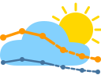
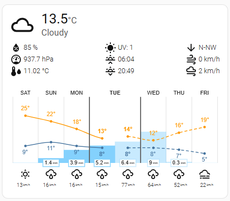
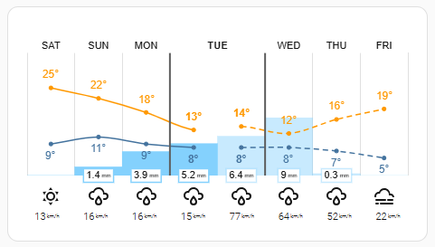
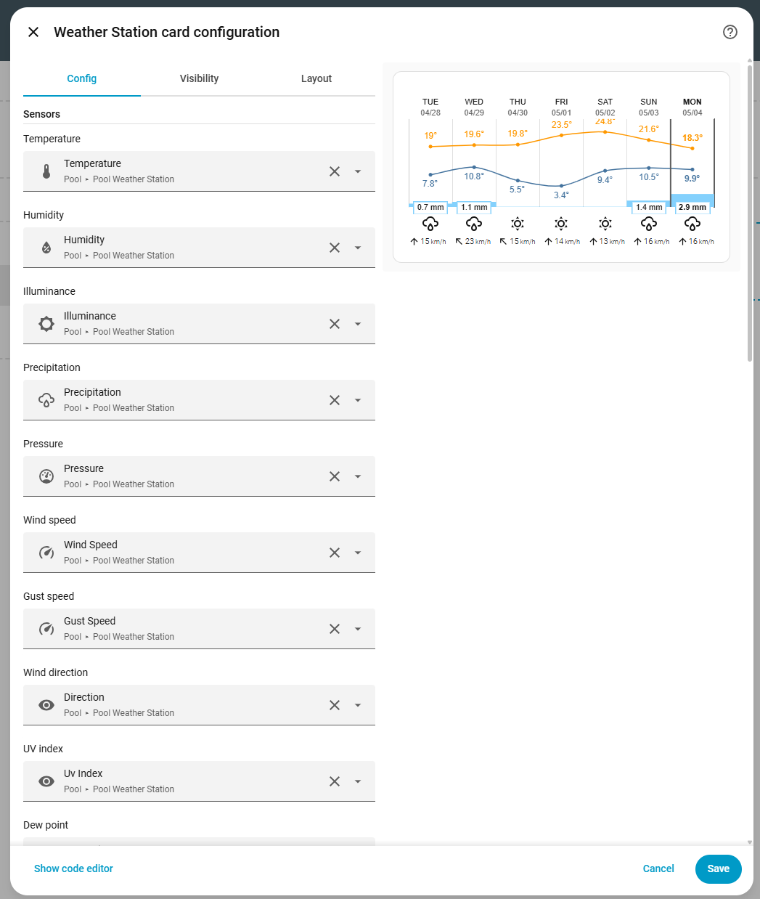
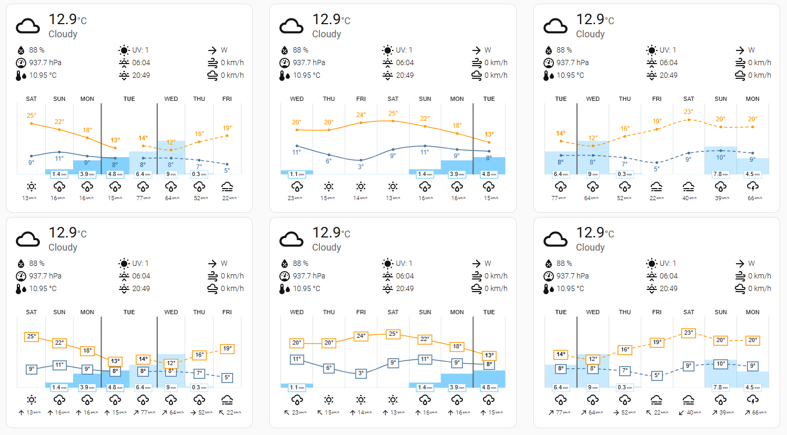

<p align="center">
  
</p>

<h1 align="center">Weather Station Card</h1>

<p align="center"><em>Weather station meets forecast.</em></p>

<p align="center">
  <a href="LICENSE.md"></a>
  <a href="https://hacs.xyz/"></a>
  <a href="https://github.com/chriguschneider/weather-station-card/releases/latest"></a>
  <a href="https://github.com/chriguschneider/weather-station-card/actions/workflows/build.yml"></a>
  <a href="https://github.com/chriguschneider/weather-station-card/releases"></a>
  <a href="https://github.com/chriguschneider/weather-station-card/stargazers"></a>
  <a href="https://github.com/chriguschneider/weather-station-card/commits/master"></a>
  <a href="https://buymeacoffee.com/chriguschneider"></a>
  <a href="#ai-assisted-development"></a>
</p>

<p align="center">
  <a href="https://my.home-assistant.io/redirect/hacs_repository/?owner=chriguschneider&category=dashboard&repository=weather-station-card"></a>
  &nbsp;·&nbsp;
  <a href="https://github.com/chriguschneider/weather-station-card/issues">Issues</a>
  &nbsp;·&nbsp;
  <a href="https://github.com/chriguschneider/weather-station-card/discussions">Discussions</a>
  &nbsp;·&nbsp;
  <a href="ARCHITECTURE.md">Architecture</a>
  &nbsp;·&nbsp;
  <a href="CONTRIBUTING.md">Contributing</a>
  &nbsp;·&nbsp;
  <a href="CHANGELOG.md">Changelog</a>
</p>

A Lovelace card that charts your own weather station's history alongside any
forecast — driven by sensor data, not a `weather.*` entity.

| Main panel + chart | Standalone chart | Visual editor |
| --- | --- | --- |
|  |  |  |

## What this card does

Most Lovelace weather cards visualise a forecast served by a `weather.*`
entity. If you actually run a weather station on-site (Shelly Plus H&T,
BTHome, ESPHome, Pirateweather receiver, …), the more interesting view is
*what happened over the past N days* — and the most useful "now" panel
reflects the live readings of those same sensors. This card does both:

- A **past chart** with high / low temperature curves and daily
  precipitation bars, plus an icon row of the worst-of-day weather
  condition for each column. Today's column is highlighted. The number
  of days is configurable (`days:`, 1–14).
- An optional **forecast block** driven by a `weather.*` entity, drawn
  in the same per-day layout next to the past chart. Forecast
  temperature lines are dashed and forecast precipitation bars render
  semi-transparent so predicted values read distinctly from measured
  ones. Span is configurable separately (`forecast_days:`).
- A **live main panel** showing the current temperature, condition icon,
  and (optionally) clock and weather attributes — all derived from current
  sensor states, not from a forecast.

Conditions are derived by a deterministic, meteorologically-grounded
classifier (see [How conditions are determined](#how-conditions-are-determined)
below — every threshold is tied to a WMO / NWS / AMS / IES source).

## Three modes

The same card renders three distinct layouts depending on which blocks
are enabled. Each mode pairs with two `forecast.style` variants ("with
boxes" / "without boxes"), giving the six layouts shown below — top row
is the default style (`style2`, without boxes), bottom row is
`style1` (with boxes).



> **Combination** (left column): past N days from your sensors + today
> as a doubled column (measured + predicted) + forecast N days from a
> `weather.*` entity. Forecast temperature lines are dashed and
> forecast precipitation bars draw at ~45 % opacity so predicted values
> read distinctly from measured ones.
>
> **Station** (centre): the original layout — past 7 days from your
> sensors, today as the rightmost column. No `weather.*` entity needed.
>
> **Forecast** (right): forecast-only — no station-history block. Useful
> when the card is paired with another sensor-history visualisation
> elsewhere on the dashboard.

```yaml
type: custom:weather-station-card
days: 7
sensors:
  temperature: sensor.YOUR_TEMPERATURE_SENSOR
  # … (rest as in the example config below)
weather_entity: weather.home   # any weather.* entity that supports daily forecast
forecast_days: 7
show_forecast: true            # turn the forecast block on
show_station: true             # default; flip to false for forecast-only
```

Both blocks toggle independently — leave `show_forecast: false` (the
default) for the original station-only experience, or set
`show_station: false` to hide the historical block.

### Daily vs. hourly resolution

`forecast.type` (added in v0.8) flips both blocks to hour resolution:
station data is aggregated per hour from the recorder (`period: 'hour'`,
mean per slot, single temperature line), and the forecast subscribes
with `forecast_type: 'hourly'`. Combination mode renders past hours +
future hours joined at a "now" line — no doubled-today column.

`days` and `forecast_days` keep their meaning at hourly: they're
the **data window in days**, so `days: 7` at hourly loads `7 × 24 =
168` hours of station history. `forecast.number_of_forecasts`
controls how many of those bars are visible at once — the chart
row, conditions row, and wind row all scroll horizontally in
lockstep. Default `8` works for both modes (fits 7-day daily without
scrolling and caps the hourly viewport at ~8 hours); set `0` to
disable the viewport and show everything.

## Installation

### HACS (Custom Repository)

**One-click**: [](https://my.home-assistant.io/redirect/hacs_repository/?owner=chriguschneider&category=dashboard&repository=weather-station-card)

Or manually:

1. In HACS, go to **Frontend → ⋮ → Custom repositories**.
2. Add `https://github.com/chriguschneider/weather-station-card` with
   category **Dashboard**.
3. Click **Install** on the *Weather Station Card* entry that appears in the
   Frontend list.
4. Hard-refresh your browser (Ctrl-F5 or equivalent) so the new resource
   loads.
5. Add the card to your dashboard via the Lovelace UI ("Add Card → Custom:
   Weather Station Card") or paste the YAML below.

### Manual

1. Download `weather-station-card.js` from the [latest release](https://github.com/chriguschneider/weather-station-card/releases/latest).
2. Copy it to `<config>/www/community/weather-station-card/`.
3. In Home Assistant, go to **Settings → Dashboards → Resources** and add
   `/local/community/weather-station-card/weather-station-card.js` as a
   JavaScript module.
4. Hard-refresh and add the card.

## Example config

### Minimal — just a temperature curve

```yaml
type: custom:weather-station-card
sensors:
  temperature: sensor.YOUR_TEMPERATURE_SENSOR
```

### Typical — all common sensors

```yaml
type: custom:weather-station-card
title: Weather Station
days: 7
show_main: true
sensors:
  temperature: sensor.YOUR_TEMPERATURE_SENSOR
  humidity: sensor.YOUR_HUMIDITY_SENSOR
  illuminance: sensor.YOUR_ILLUMINANCE_SENSOR
  precipitation: sensor.YOUR_PRECIPITATION_SENSOR
  pressure: sensor.YOUR_PRESSURE_SENSOR
  wind_speed: sensor.YOUR_WIND_SPEED_SENSOR
  gust_speed: sensor.YOUR_GUST_SPEED_SENSOR
  wind_direction: sensor.YOUR_WIND_DIRECTION_SENSOR
  uv_index: sensor.YOUR_UV_INDEX_SENSOR
  dew_point: sensor.YOUR_DEW_POINT_SENSOR
units:
  speed: km/h
```

Only `sensors.temperature` is strictly required; the rest are optional but
each one unlocks more chart series, attribute readouts, and live-condition
classifier inputs.

## Configuration reference

The visual editor groups options into six sections — [A. Setup](#config-setup),
[B. Sensors](#config-sensors), [C. Layout](#config-layout),
[D. Style & Colours](#config-style), [E. Units](#config-units),
[F. Advanced](#config-advanced). The reference below mirrors that order.
All sections are open by default — use Ctrl-F / Cmd-F to find any key.

<a id="config-setup"></a>
<details open>
<summary><b>A. Setup</b></summary>

The mode selector decides which blocks render. The YAML keeps two
separate booleans (`show_station`, `show_forecast`) for backwards
compatibility — the editor projects them onto a single radio.

| Key | Type | Default | Description |
| --- | --- | --- | --- |
| `type` | string | — | Always `custom:weather-station-card`. |
| `title` | string | _none_ | Card header. Omit for a header-less card. |
| `show_station` | bool | `true` | Render the past station-history block on the left. (Editor: Mode.) |
| `show_forecast` | bool | `false` | Render the forecast block on the right. (Editor: Mode.) Requires `weather_entity`. |
| `weather_entity` | string | _none_ | `weather.*` entity used for the forecast block. Required when `show_forecast: true`. |
| `days` | integer | `7` | Number of past days (station block). 1–14. |
| `forecast_days` | integer | `days` | Number of forecast columns; defaults to the same span as `days`. |
| `tap_action` | object | `{ action: none }` | Action triggered by a single click on the card. See [Actions](#actions) below. |
| `hold_action` | object | `{ action: none }` | Action triggered by holding the card for ≥ 500 ms. |
| `double_tap_action` | object | `{ action: none }` | Action triggered by a double click within 250 ms. |

#### Actions

The card exposes the standard Home Assistant action selector for tap, hold,
and double-tap. The supported `action` values are the ones HA's UI editor
offers — `more-info`, `navigate`, `url`, `toggle`, `perform-action`,
`assist`, and `none` (the default). The action runs on the **whole card**;
clicks anywhere on the chart, the main panel, or the attribute row trigger
the same configured action.

```yaml
tap_action:
  action: navigate
  navigation_path: /lovelace-garden
hold_action:
  action: more-info
  entity: sensor.outdoor_temperature
double_tap_action:
  action: perform-action
  perform_action: light.toggle
  target:
    entity_id: light.terrace
```

For `more-info` and `toggle`, if no `entity` is set the action falls back to
`sensors.temperature`. The cursor only switches to a hand when at least one
action is non-`none`, so the default read-only card looks read-only.

</details>

<a id="config-sensors"></a>
<details open>
<summary><b>B. Sensors</b></summary>

All keys are sensor `entity_id`s. Values populate the chart, the live "now"
classifier, and (where relevant) the attribute readouts. Only
`sensors.temperature` is strictly required.

| Key | Used for |
| --- | --- |
| `sensors.temperature` | Temperature curves (high/low), main-panel temperature, classifier |
| `sensors.humidity` | Humidity attribute, fog detection |
| `sensors.illuminance` | Cloud-cover ratio for live + daily conditions |
| `sensors.precipitation` | Precipitation bars, rainy/pouring/snowy classification |
| `sensors.pressure` | Pressure attribute |
| `sensors.wind_speed` | Mean-wind classification, attribute readout |
| `sensors.gust_speed` | Gust-based windy/exceptional classification |
| `sensors.wind_direction` | Wind direction attribute & arrow |
| `sensors.uv_index` | UV attribute |
| `sensors.dew_point` | Fog detection (combined with humidity) |
| `sensors.sunshine_duration` | Today's live sunshine value (scalar, seconds or hours auto-detected at the `≥ 30` threshold). Past columns fall back to the recorder's daily-max for this same sensor. Only used when `forecast.show_sunshine: true`. |

</details>

<a id="config-layout"></a>
<details open>
<summary><b>C. Layout</b> — main panel, attributes row, chart rows</summary>

Three master toggles (`show_main`, `show_attributes`, plus the chart-row
toggles). In the editor each master expands its sub-fields only when
ON; in YAML the sub-keys are evaluated regardless.

**Main panel** (gated by `show_main: true`)

| Key | Type | Default | Description |
| --- | --- | --- | --- |
| `show_main` | bool | `false` | Show the live "now" panel (icon + temperature + condition). |
| `show_temperature` | bool | `true` | Show current temperature. |
| `show_current_condition` | bool | `true` | Show condition text under temperature. |
| `show_time` | bool | `false` | Live clock. |
| `show_time_seconds` | bool | `false` | Include seconds in the clock. |
| `use_12hour_format` | bool | `false` | Use 12-hour clock. |
| `show_day` | bool | `false` | Day-of-week label. |
| `show_date` | bool | `false` | Date label. |

**Attributes row** (gated by `show_attributes: true`; each entry also requires the corresponding sensor)

| Key | Type | Default | Description |
| --- | --- | --- | --- |
| `show_attributes` | bool | `false` | Show humidity / pressure / dew point / sun / wind row. |
| `show_humidity` | bool | `true` | Humidity attribute. |
| `show_pressure` | bool | `true` | Pressure attribute. |
| `show_dew_point` | bool | `false` | Dew-point attribute. |
| `show_wind_direction` | bool | `true` | Wind-direction arrow. |
| `show_wind_speed` | bool | `true` | Wind-speed value. |
| `show_wind_gust_speed` | bool | `false` | Gust speed (requires `sensors.gust_speed`). |
| `show_sun` | bool | `false` | Sunrise / sunset row. |

**Chart rows**

| Key | Type | Default | Description |
| --- | --- | --- | --- |
| `forecast.condition_icons` | bool | `true` | Condition icons row above the chart. |
| `forecast.show_wind_forecast` | bool | `true` | Wind row below the chart. |
| `forecast.show_wind_arrow` | bool | `true` | Show the per-day wind-direction arrow inside the wind row. When the arrow is on and a column is too narrow to fit the arrow + speed side-by-side, the speed wraps onto a second line below the arrow. |
| `forecast.show_date` | bool | `true` | `dd/mm` date row in the X-axis. When off, only the weekday is rendered. |
| `forecast.show_sunshine` | bool | `false` | Sunshine-duration column inside the chart — half-bar in yellow on the right of every column (precipitation keeps the left half), with the day's hours rendered as a small "Xh" label at the top of the column. Off by default; turning it on without configuring at least one of the sunshine sensors below renders empty bars and labels (no warning, no banner). See the [Sunshine duration](#sunshine-duration) section for setup recipes. |

</details>

<a id="config-style"></a>
<details open>
<summary><b>D. Style & Colours</b></summary>

**Chart appearance**

| Key | Type | Default | Description |
| --- | --- | --- | --- |
| `forecast.style` | `'style2' \| 'style1'` | `'style2'` | Temperature-label rendering. `style2` (default) shows plain text beside the lines; `style1` boxes each value with the line-coloured border. |
| `forecast.round_temp` | bool | `false` | Round temperature labels to integers. |
| `forecast.disable_animation` | bool | `false` | Disable chart redraw animation. |

**Sizing**

| Key | Type | Default | Description |
| --- | --- | --- | --- |
| `icons_size` | number (px) | `25` | Forecast-row icon size. |
| `current_temp_size` | number (px) | `28` | Main-panel temperature font size. |
| `time_size` | number (px) | `26` | Clock font size. |
| `day_date_size` | number (px) | `15` | Day / date label font size. |
| `forecast.labels_font_size` | number (px) | `11` | Chart axis tick label size. The wind unit and the precip unit ("mm" / "km/h") render at half this size. |
| `forecast.chart_height` | number (px) | `180` | Chart canvas height. |
| `forecast.precip_bar_size` | number (%) | `100` | Width of precipitation bars (0–100 %). |

**Icons**

| Key | Type | Default | Description |
| --- | --- | --- | --- |
| `icon_style` | `'style1' \| 'style2'` | `'style1'` | Bundled icon set. |
| `animated_icons` | bool | `false` | Use animated SVGs. |
| `icons` | string (URL) | _none_ | Override icon base path (custom set). |

**Colours** (collapsed in editor)

| Key | Type | Default | Description |
| --- | --- | --- | --- |
| `forecast.temperature1_color` | CSS colour | `rgba(255, 152, 0, 1.0)` | High-temperature curve. |
| `forecast.temperature2_color` | CSS colour | `rgba(68, 115, 158, 1.0)` | Low-temperature curve. |
| `forecast.precipitation_color` | CSS colour | `rgba(132, 209, 253, 1.0)` | Precipitation bars. Forecast bars (combination mode) render at ~45 % of this colour's alpha. |
| `forecast.sunshine_color` | CSS colour | `rgba(255, 193, 7, 1.0)` | Sunshine bars. Same forecast-side alpha treatment as precipitation. |
| `forecast.chart_datetime_color` | CSS colour or `'auto'` | _none_ | X-axis weekday / date colour. |
| `forecast.chart_text_color` | CSS colour or `'auto'` | _none_ | All other chart text colour. |

</details>

<a id="config-units"></a>
<details open>
<summary><b>E. Units</b></summary>

| Key | Values | Description |
| --- | --- | --- |
| `units.pressure` | `'hPa' \| 'mmHg' \| 'inHg'` | Display unit; auto-converts from the sensor's native unit. |
| `units.speed` | `'m/s' \| 'km/h' \| 'mph' \| 'Bft'` | Display unit; auto-converts. |

</details>

<a id="config-advanced"></a>
<details open>
<summary><b>F. Advanced</b> — forecast type, locale, classifier overrides</summary>

| Key | Type | Default | Description |
| --- | --- | --- | --- |
| `forecast.type` | `'daily' \| 'hourly'` | `'daily'` | At hourly, station data is fetched at hour resolution (mean per hour, single temperature line) and the forecast is subscribed with `forecast_type: hourly`. `days` / `forecast_days` define the data window (so `days: 4` at hourly = 96 hours of station history). Editor radio in Setup. |
| `forecast.number_of_forecasts` | integer | `8` | Number of bars visible in the viewport at once. Default `8` works across both modes — at daily with `days: 7` everything fits without scrolling, at hourly it caps the viewport at ~8 hours and the user scrolls. Set `0` for "fit all" (no scrolling). When more bars are loaded than visible, the chart row + wind row + conditions row scroll horizontally in lockstep. Initial scroll position is "now" (centred at the station/forecast boundary in combination mode). |
| `locale` | string | HA's selected language | Override locale (e.g. `de`, `fr`). Falls back to English for missing keys. |

**`condition_mapping` — override classifier thresholds**

Every value documented in [How conditions are determined](#how-conditions-are-determined)
can be overridden. Defaults are meteorologically grounded — only set what you
want to change. The editor exposes the same fields under Advanced; empty
fields use the default.

| Key                        | Unit  | Default | Used by rule |
| -------------------------- | ----- | ------- | ------------ |
| `rainy_threshold_mm`       | mm    | 0.5     | Precipitation tier (rainy / snowy / snowy-rainy) |
| `pouring_threshold_mm`     | mm    | 10      | Precipitation tier (pouring) |
| `exceptional_gust_ms`      | m/s   | 24.5    | Exceptional (Beaufort 10) |
| `exceptional_precip_mm`    | mm    | 50      | Exceptional (NWS heavy-rain outlook) |
| `snow_max_c`               | °C    | 0       | snowy cutoff (temp_max ≤ value) |
| `snow_rain_max_c`          | °C    | 3       | snowy-rainy cutoff |
| `fog_humidity_pct`         | %     | 95      | Fog rule (humidity ≥ value) |
| `fog_dewpoint_spread_c`    | °C    | 1       | Fog rule (temp_min − dew_point ≤ value) |
| `fog_wind_max_ms`          | m/s   | 3       | Fog rule (wind_mean < value — fog dissipates with wind) |
| `windy_threshold_ms`       | m/s   | 10.8    | windy / windy-variant on gust |
| `windy_mean_threshold_ms`  | m/s   | 8.0     | windy / windy-variant on mean wind |
| `sunny_cloud_ratio`        | ratio | 0.70    | sunny cutoff (cloud_ratio ≥ value) |
| `partly_cloud_ratio`       | ratio | 0.30    | partlycloudy cutoff |

```yaml
# Example: warmer-climate station that should never report snow,
# and a sheltered location where 5 m/s gusts already feel "windy".
condition_mapping:
  snow_max_c: -5
  snow_rain_max_c: 1
  windy_threshold_ms: 5
```

```yaml
# Example: indoor-mounted illuminance sensor that maxes out earlier
# than outdoor; lower the sunny cutoff so noon still classifies as sunny.
condition_mapping:
  sunny_cloud_ratio: 0.55
  partly_cloud_ratio: 0.20
```

</details>

## Current ("now") condition

When `show_main: true`, the main panel's icon and condition text reflect a
**live** classification of the current sensor states (re-evaluated whenever
any sensor updates). The same classifier is used as for the daily forecast
columns, fed with instantaneous values and an instantaneous clear-sky
reference (zenith from latitude + longitude + current UTC time).

Day/night-aware icons are still automatic: when `sun.sun` is below the
horizon, `sunny` and `partlycloudy` swap to their night variants
(`clear-night`, `partlycloudy-night`).

### Precipitation in the live condition needs a *rate* unit

Turning a cumulative precipitation counter into an instantaneous rainfall
rate requires extra history that the live path does not keep. Therefore
**precipitation only contributes to the live "now" condition when the
sensor's `unit_of_measurement` ends in `/h`, `/hr`, or `/hour`**:

| Sensor `unit_of_measurement`                      | Used for live rain? |
| ------------------------------------------------- | ------------------- |
| `mm/h`, `mm/hr`, `mm/hour`, `in/h`                | ✅ yes               |
| `mm`, `in` (cumulative counter or daily total)    | ❌ falls through to cloud / wind / fog |
| _missing_                                         | ❌ falls through |

The **daily chart** has no such restriction — it derives daily totals via
the recorder's statistics regardless of unit (see next section), and the
worst-of-day classification uses those totals directly.

If you only have a cumulative counter, the live "now" icon will not show
rain even while it is raining; the daily chart still reports the day's
total correctly. To get a true live rain icon, expose a `mm/h` rate sensor
(many integrations provide one alongside the counter — e.g. Pirateweather's
`*_precipitation_rate`, Ecowitt's `*_rain_rate`, ESPHome
`pulse_meter`-derived rate templates).

## Setting up a precipitation sensor

The precipitation bars show **mm of rain per day**, not running totals.
Most weather-station integrations (Ecowitt, Pirateweather, BTHome,
ESPHome `pulse_meter`, …) expose a cumulative `total_increasing` counter
in mm — plug it into `sensors.precipitation` and the daily values come
out right. The data layer also accepts `total` counters and `measurement`
sensors that already represent "today's rain" (e.g. via a daily
`utility_meter`).

## Sunshine duration

Set `forecast.show_sunshine: true` and you're done. The card adds a
yellow half-bar on the right of every column (precipitation keeps the
left half) and a small "Xh" label at the top of the column. Sunshine
values come directly from
[Open-Meteo](https://open-meteo.com/)'s `daily=sunshine_duration`
endpoint — no extra sensors, no YAML, nothing to set up.

```yaml
forecast:
  show_sunshine: true
```

The card uses your Home Assistant location (`hass.config.latitude`
/ `longitude`) to query Open-Meteo, fetches once on first render, and
re-fetches at most once an hour. The response covers the past N days
plus the next N forecast days in a single call. The bar colour is
`forecast.sunshine_color` (default Material amber).

**Privacy note**: enabling sunshine sends your latitude / longitude to
`api.open-meteo.com` from each browser that renders the dashboard. The
data is fetched client-side, so it's not centralised on your HA server.
Open-Meteo's privacy policy is at
[open-meteo.com/en/terms](https://open-meteo.com/en/terms). If you'd
rather not have any browser call out, leave `show_sunshine` off
(default).

In hourly mode the bars are per-hour fractions (full bar = full hour
of sun, empty bar = night or fully overcast). The numeric "Xh" box is
suppressed at hourly because 168 narrow columns over a 7-day window
can't fit a label per bar — the bar height alone encodes the value.

### Limitations

- **Lux-derived sunshine** (use your own illuminance sensor instead of
  the Open-Meteo model) — calibration data in
  [issue #6](https://github.com/chriguschneider/weather-station-card/issues/6).
- **PV-output-derived sunshine** for users with a solar inverter — same
  issue.
- **Local-network-only operation** — the Open-Meteo path needs internet.

## How conditions are determined

Every day's icon — and the live "now" icon — is derived from the relevant
sensor values by a deterministic classifier (`src/condition-classifier.js`).
It evaluates rules in priority order (worst-of-day): once a rule matches,
no later rules are checked. Conditions `lightning`, `lightning-rainy`, and
`hail` are **never emitted** — reliable detection requires dedicated
hardware (AS3935 lightning detector, hail-pad / impact sensor) that a
typical weather station does not provide.

### Decision tree

| Order | Condition       | Trigger                                                                                              | Source                                                |
|-------|-----------------|------------------------------------------------------------------------------------------------------|-------------------------------------------------------|
| 1     | `exceptional`   | gust ≥ 24.5 m/s OR daily precipitation ≥ 50 mm                                                       | Beaufort 10 (WMO No. 306); NWS Excessive Rainfall Outlook |
| 2a    | `snowy`         | precipitation ≥ 0.5 mm AND temp_max ≤ 0 °C                                                           | AMS Glossary "Wet-bulb temperature"; WMO No. 8 Annex 4D |
| 2b    | `snowy-rainy`   | precipitation ≥ 0.5 mm AND temp_max ≤ 3 °C                                                           | AMS Glossary "Sleet"; NWS precip-type partition       |
| 2c    | `pouring`       | precipitation ≥ 10 mm                                                                                | NWS heavy-rain rate (> 7.6 mm/h); Met Office daily    |
| 2d    | `rainy`         | precipitation ≥ 0.5 mm                                                                               | WMO trace-amount cutoff                               |
| 3     | `fog`           | humidity ≥ 95 % AND (temp_min − dew_point_mean) ≤ 1 °C AND wind_mean < 3 m/s                         | METAR FG; AMS Glossary "Fog"                          |
| 4     | `windy-variant` | (gust ≥ 10.8 m/s OR wind_mean ≥ 8.0 m/s) AND cloud_ratio < 0.70                                      | Beaufort 6 / Bft 5 (WMO No. 306)                      |
| 4     | `windy`         | (gust ≥ 10.8 m/s OR wind_mean ≥ 8.0 m/s) AND cloud_ratio ≥ 0.70                                      | Beaufort 6 / Bft 5 (WMO No. 306)                      |
| 5     | `sunny`         | cloud_ratio ≥ 0.70                                                                                   | WMO oktas 0–2/8                                       |
| 5     | `partlycloudy`  | 0.30 ≤ cloud_ratio < 0.70                                                                            | WMO oktas 3–6/8                                       |
| 5     | `cloudy`        | cloud_ratio < 0.30 (or illuminance sensor missing)                                                   | WMO oktas 7–8/8                                       |

`cloud_ratio` is `lux_max / clearsky_lux`, where `clearsky_lux ≈ 110 000 lx
× cos(zenith)` (IES Lighting Handbook §3 for the sea-level clear-sky
maximum; Cooper 1969 declination + standard solar-noon / hour-angle
geometry). Latitude / longitude come from `hass.config.*` automatically.

## Troubleshooting

The card surfaces problems via a red banner at the top. Each line maps to
a concrete cause:

| Banner text                                | What broke                                                     | What to do |
| ------------------------------------------ | -------------------------------------------------------------- | ---------- |
| `Statistics fetch failed: …`               | The `recorder/statistics_during_period` WebSocket call threw three times in a row. Often a recently-added or renamed sensor with no history yet. | Wait an hour for the recorder to accumulate, or remove the entity from `sensors.*` until it has data. |
| `Forecast unavailable: weather_entity not configured` | `show_forecast: true` but `weather_entity:` is empty. | Set `weather_entity:` to a `weather.*` entity, or set `show_forecast: false`. |
| `Forecast unavailable: weather entity "X" not found` | The entity ID is misspelled or the integration is unloaded. | Check **Developer Tools → States** for the actual entity ID. |
| `Forecast unavailable: entity "X" does not support daily forecasts` | The integration only exposes `hourly` (e.g. some Met.no, OpenWeatherMap configurations). | Either pick a different `weather.*` entity, or accept that this card is daily-only for now (`forecast.type: hourly` is upstream-defined but not yet wired in this fork). |
| `Chart render failed: <phase>: …`          | Chart.js or one of the custom plugins threw mid-render. The phase tag (`compute` / `init` / `draw`) tells you the rough location; the message is the underlying error. | Open the browser devtools console for the full stack. Most often: a sensor whose `unit_of_measurement` changed mid-history, or a `condition_mapping` override with the wrong type. |
| `Sensors unavailable: temperature (sensor.X), …` | The listed entities exist but report `unavailable` / `unknown`. | Card stays alive — just shows the live panel without those values. Check the sensor in **Developer Tools** to see why it's offline. |

### The card looks empty / no chart appears

- **Brand-new sensor with no history.** The recorder takes one hour to
  produce the first daily statistic. Wait, then refresh.
- **Browser cached the old bundle after an update.** Resources go through
  HACS's `?hacstag=` query — bumping it (Settings → Dashboards → Resources,
  edit the entry, change the suffix) forces every browser to re-fetch.
  A "Reload frontend" via your user profile menu also works.
- **Wrong unit_system (US-vs-metric).** The chart's precip-axis maximum
  defaults differ between metric (`length: km` → 20 mm full-scale) and
  imperial (`length: mi` → 1 in full-scale). If your unit system is set
  in HA but your sensors emit the other unit, the bars will look tiny or
  clipped. Override `forecast.precip_bar_size` and check
  `unit_of_measurement` on the sensor.

### Today's column is doubled — is that a bug?

No — when both `show_station: true` and `show_forecast: true`, today
appears twice on purpose: once as the *measured* daily aggregate (left
edge of the forecast block), and once as the *predicted* value from
`weather_entity` (right edge of the station block). The two columns are
framed together by thicker borders to read as one "today" unit. Set
`show_forecast: false` for the original single-today layout.

### Live "now" icon shows the wrong condition

- **Rain icon never appears.** The live classifier ignores cumulative
  precipitation counters (see [Precipitation in the live condition needs a
  *rate* unit](#precipitation-in-the-live-condition-needs-a-rate-unit)).
  Wire a `mm/h` sensor as `sensors.precipitation` if you want live rain.
- **`sunny` at noon when it's overcast / `cloudy` at noon when it's clear.**
  The cloud-cover ratio is `lux_max / clearsky_lux`. Indoor or
  partially-shaded illuminance sensors will read low and trigger `cloudy`;
  sensors aimed at a reflective surface can read high and trigger `sunny`.
  Tune `condition_mapping.sunny_cloud_ratio` and `partly_cloud_ratio` to
  match your sensor's typical noon reading.
- **`fog` at every overnight humidity peak.** Fog requires *all three*:
  humidity ≥ 95 %, dew-point spread ≤ 1 °C, and wind_mean < 3 m/s. If
  you're seeing it on calm humid nights without actual fog, raise
  `fog_humidity_pct` to 97 or lower `fog_dewpoint_spread_c` to 0.5.

### Editor changes don't take effect

Visual editor edits hit `setConfig()` — most options apply on the next
render tick. If a field doesn't seem to update:

- Toggling `show_station` or `show_forecast` triggers a full data-source
  rebuild (~1 s). Wait a moment.
- Editor sliders bound to `forecast.*` sub-keys can sometimes write the
  string `'25'` instead of the number `25`; the card coerces, but if you
  see a chart sized oddly, check the YAML view for stray quotes.

## Known limitations

For the toggles below, the YAML keys are still parsed but the visual
editor **does not surface them** while their behaviour is broken or
vestigial. Tracking issues are linked.

| Field | Symptom | Tracking |
| --- | --- | --- |
| Hourly wind values blank with Open-Meteo | At `forecast.type: hourly`, the wind row of the *forecast* block renders empty cells when the upstream `weather.*` integration omits per-hour wind data. HA's Open-Meteo integration ([source](https://github.com/home-assistant/core/blob/dev/homeassistant/components/open_meteo/weather.py) — see `_async_forecast_hourly`) currently ships only `datetime`, `condition`, `precipitation` and `temperature` per hourly entry; `wind_speed` / `wind_bearing` are present only on the daily branch. Met.no and other integrations may differ. The card hides the arrow + value when either field is missing, so cells stay empty rather than showing a default-direction arrow with an orphan unit. | upstream integration |

Reactions / comments on the linked issues help prioritise the wiring
work. PRs welcome — the relevant code paths are linked from each issue.

## Translations

The visual editor and condition labels are translated via `src/locale.js`.
Each language has condition-name + unit-label keys and an optional
`editor: { … }` block for the visual editor. Currently only English and
German ship with a complete editor block; other languages fall through to
English at runtime via `tEditor()` (no crashes, just English labels).

Adding a language is a small, well-bounded contribution: see
[CONTRIBUTING.md](CONTRIBUTING.md). PRs welcome.

## Contributing & architecture

PRs welcome — see [CONTRIBUTING.md](CONTRIBUTING.md) for the build flow.
For a tour of how the card is wired internally (data sources, the merge
model, the chart-plugin contract), read [ARCHITECTURE.md](ARCHITECTURE.md).

## AI-assisted development

This card is built by Chrigu & Claude — a human and an LLM working
together. Architecture decisions, design trade-offs, the
meteorological grounding of the condition classifier, and the
"what should this actually do?" calls are mine. A large share of
the typing, refactors, test scaffolding, and tedious chart-plugin
plumbing was done by [Claude Code](https://claude.com/claude-code).

Every line is reviewed, tested (`npm run build` runs lint + 80%+
coverage tests + visual regression on every push), and shipped
consciously. The badge is here because transparency about how
software is made matters more than pretending otherwise.

If the card has earned a spot on your dashboard, [buying me a coffee](https://buymeacoffee.com/chriguschneider)
is the nicest way to say thanks ❤️ *(Claude doesn't drink coffee.
More for me.)*

## Community

- 💬 **Have a question or idea?** Open a [Discussion](https://github.com/chriguschneider/weather-station-card/discussions) — better than an issue if you're not sure whether something's a bug or just an unfamiliar config knob.
- 🐛 **Found a bug or want a specific feature?** [Open an issue](https://github.com/chriguschneider/weather-station-card/issues/new/choose).
- 🔧 **Want to contribute?** See [CONTRIBUTING.md](CONTRIBUTING.md) — adding a translation or a small fix is a well-bounded first PR.

### Contributors

<a href="https://github.com/chriguschneider/weather-station-card/graphs/contributors">
  
</a>

## Attribution & licence

This project is a fork of [`mlamberts78/weather-chart-card`](https://github.com/mlamberts78/weather-chart-card)
v1.0.1 (October 2024). The chart UI, icons, and renderer come from the
upstream — what's new here is the sensor-history data layer
(`src/data-source.js`), the meteorological condition classifier
(`src/condition-classifier.js`), the live-condition wiring, and the editor
adjustments for sensor selection.

Released under the MIT licence — same as upstream. See [LICENSE.md](LICENSE.md).
